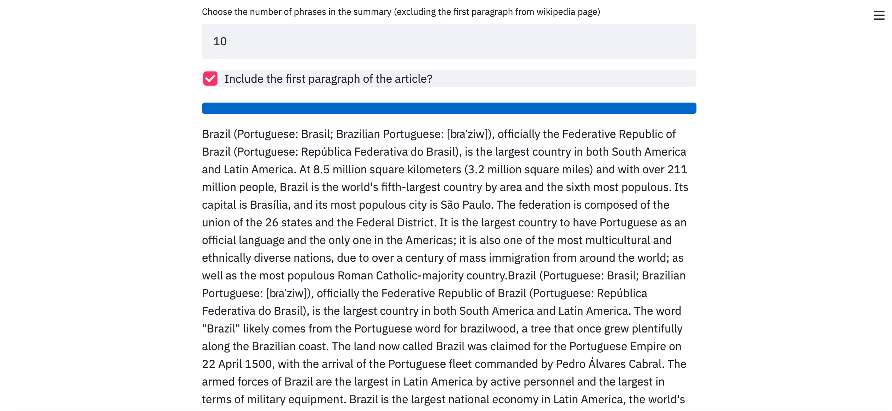

# text_summarization
A simple script for summarizing Wikipedia texts

This project is available for testing <a href="https://lucas-summarizer.herokuapp.com/">here</a>

This project extracts the content of a wikipedia page using the Wikipedia Python library (link <a href="https://pypi.org/project/wikipedia/">here</a>) and build a summary using NLP techniques. The most important phrases are ordered as the Wikipedia article and there is an option to include the first paragraph of the article for enhancing the text.

I uploaded two versions: a .ipynb version for running with Jupyter Notebook|Lab or Google Colab and a .py version that is a streamlit app version that runs with a browser. The figures below show an example of the browser version:

